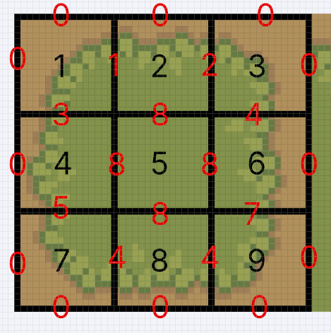
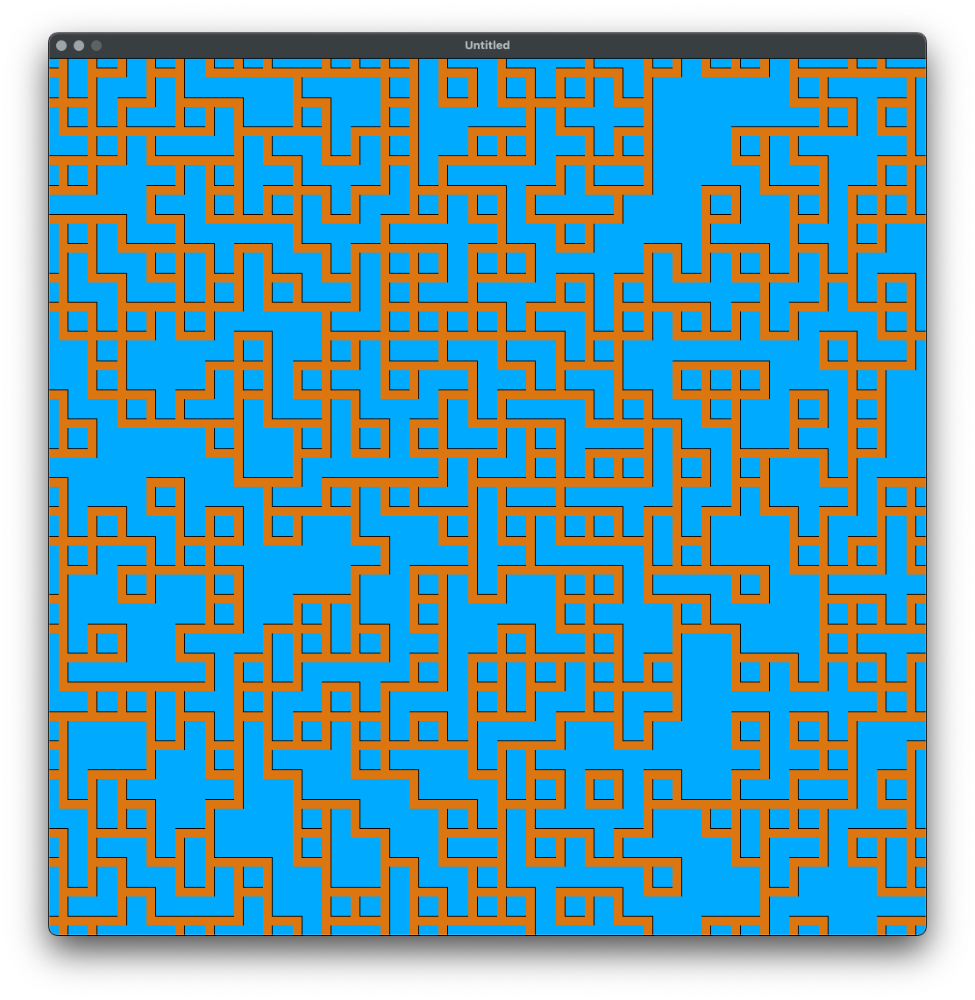
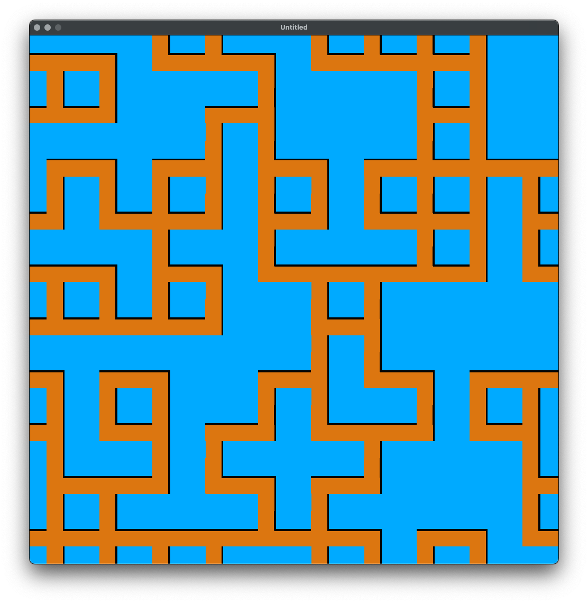
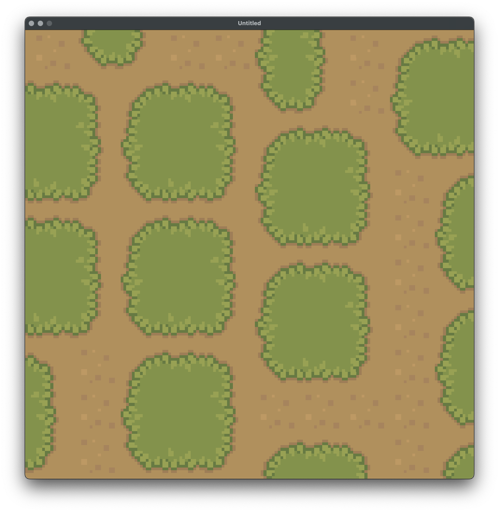

## Wave Function Collapse
Wave Function Collapse (WFC) is an algorithm used for procedural content generation. It is inspired by quantum mechanics and works by propagating constraints to generate patterns that fit a given set of rules. The algorithm starts with a grid of cells, each of which can be in multiple states. It then iteratively collapses the cells into a single state by selecting the most constrained cell and applying the constraints to its neighbors, ensuring that the final pattern is coherent and adheres to the predefined rules.

## How to use
This is a LÖVE2D Lua project, and make sure you already have it installed on your machine.
Please see the sample image in the docs folder.



You have to separate each tile since I did not implement an auto slicer for a single image. I hope I can implement it soon.
Now, look at the red numbers. These numbers represent the rule connections between the tiles. For example, tile 1 should be:


```lua
{
    id = 1,
    path = "assets/cozyfarm/1.png",
    rules = { { 0 }, { 1 }, { 3 }, { 0 } }
},
```

The rules are defined in a table representing the top, right, bottom, and left directions. You can see the full configuration for each asset.

## Output
Using sample config and dimension 30:


Using sample config and dimension 10:


Using cozyfarm config and dimension 10:


## Advantages
Since I am learning this algorithm, it may have bugs. The known bug is a blank tile because the total options are 0. I know it should have backtracking propagation to fix that issue, but I have not yet implemented the feature. The safest dimension is 10, which equals 100 tiles.

For now, I have commented out the backtracking process.

Thank you.
